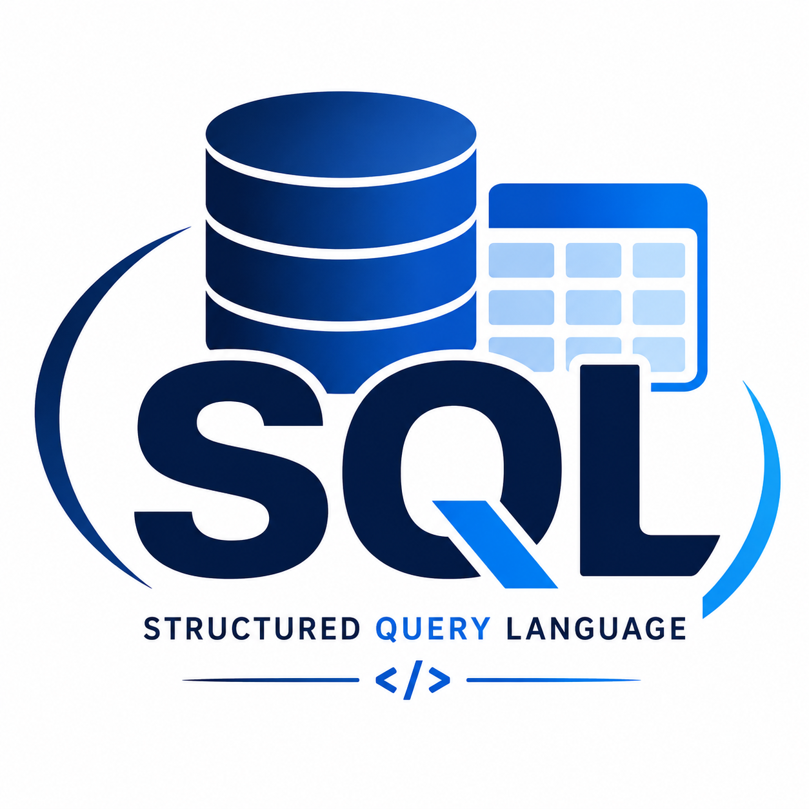
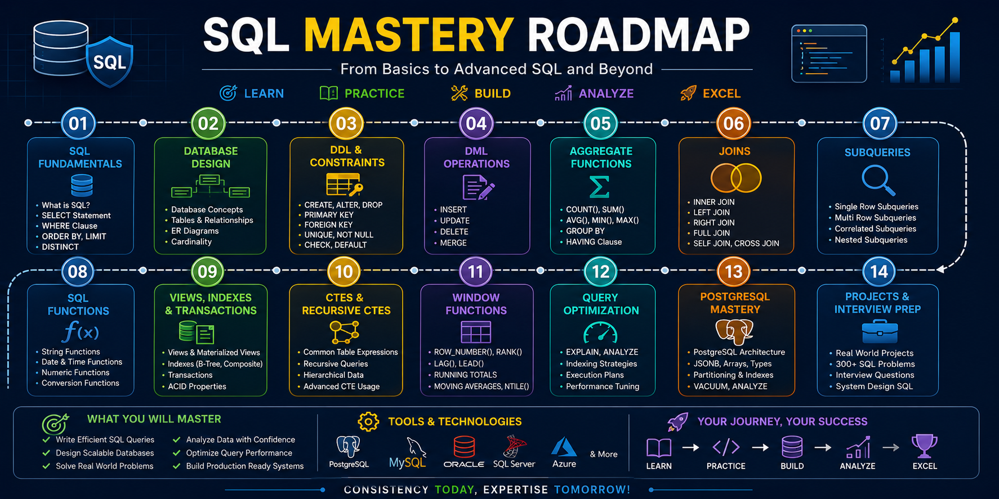

# SQL Mastery Portfolio 🚀

<div align="center">

## Complete SQL, PostgreSQL & Database Engineering Portfolio

**300+ SQL Problems • 4 Real-World Database Projects • PostgreSQL • Query Optimization • System Design • Interview Preparation**

---





</div>

---

# 📖 Overview

SQL Mastery Portfolio is a comprehensive repository designed to demonstrate practical SQL, PostgreSQL, Database Design, Analytics, Query Optimization, and System Design skills through:

* Structured SQL Learning Roadmap
* 300+ SQL Practice Problems
* 4 End-to-End Database Projects
* PostgreSQL Interview Preparation
* Query Optimization Techniques
* Window Functions Mastery
* Database System Design
* Enterprise Analytics Dashboards

This repository serves as a complete SQL learning, interview preparation, and portfolio showcase resource.

---

# 🎯 Objectives

The primary goals of this portfolio are:

✅ Master SQL Fundamentals

✅ Learn Advanced SQL Concepts

✅ Design Real Database Systems

✅ Build Analytics Dashboards

✅ Prepare for Technical Interviews

✅ Learn PostgreSQL Internals

✅ Understand Database Scalability

✅ Demonstrate Industry-Ready SQL Skills

---

# 🛠 Tech Stack

## Database

* PostgreSQL
* SQL

## Concepts

* Relational Databases
* Database Design
* ER Modeling
* Normalization
* Query Optimization
* Window Functions
* Transactions
* Indexing

## Tools

* PostgreSQL
* pgAdmin
* DBeaver
* Git
* GitHub

---

# 🗺 SQL Learning Roadmap

## Day 01

### SQL Fundamentals

Topics:

* Introduction to Databases
* SQL Basics
* SELECT
* WHERE
* ORDER BY
* LIMIT

---

## Day 02

### Database Design

Topics:

* Tables
* Relationships
* ER Diagrams
* Data Types

---

## Day 03

### DDL & Constraints

Topics:

* CREATE
* ALTER
* DROP
* Constraints

---

## Day 04

### DML

Topics:

* INSERT
* UPDATE
* DELETE

---

## Day 05

### Aggregate Functions

Topics:

* COUNT()
* SUM()
* AVG()
* MIN()
* MAX()

---

## Day 06

### JOINs

Topics:

* INNER JOIN
* LEFT JOIN
* RIGHT JOIN
* FULL JOIN
* SELF JOIN

---

## Day 07

### Subqueries

Topics:

* Nested Queries
* Correlated Queries
* EXISTS
* IN

---

## Day 08

### SQL Functions

Topics:

* String Functions
* Date Functions
* Numeric Functions

---

## Day 09

### Views, Indexes & Transactions

Topics:

* Views
* Materialized Views
* Indexes
* Transactions
* ACID Properties

---

## Day 10

### Advanced SQL

Topics:

* CTEs
* Recursive CTEs
* Window Functions
* Query Optimization
* Enterprise Analytics

---

# 📂 Repository Structure

```text
SQL-Mastery-Portfolio/
│
├── README.md
├── LICENSE
├── CONTRIBUTING.md
│
├── docs/
│   ├── SQL_Roadmap.md
│   ├── SQL_CheatSheet.md
│   ├── SQL_Interview_Questions.md
│   ├── SQL_Best_Practices.md
│   ├── Normalization_Guide.md
│   ├── Database_Design_Guide.md
│   └── Window_Functions_Guide.md
│
├── Practice-Sets/
│   ├── Beginner/
│   ├── Intermediate/
│   └── Advanced/
│
├── Projects/
│   ├── Student-Management-System/
│   ├── Employee-Management-System/
│   ├── E-Commerce-Database-System/
│   └── Hospital-Management-System/
│
├── Interview-Preparation/
│   ├── SQL_Interview_Questions.md
│   ├── SQL_Scenario_Based_Questions.md
│   ├── SQL_Optimization_Questions.md
│   ├── PostgreSQL_Questions.md
│   ├── Window_Function_Questions.md
│   └── System_Design_SQL.md
│
├── Certifications/
│   ├── achievements.md
│   └── Certifications_Tracker.md
│
└── assets/
    ├── banner.png
    ├── roadmap.png
    └── sql-logo.png
```

---

# 📚 Practice Sets

## Beginner Level

### Topics

* SELECT
* WHERE
* ORDER BY
* GROUP BY
* HAVING
* Basic Joins

### Problems

```text
50 SQL Questions
50 Solutions
```

---

## Intermediate Level

### Topics

* Advanced Joins
* Subqueries
* Functions
* Views
* Indexes
* Analytics

### Problems

```text
100 SQL Questions
100 Solutions
```

---

## Advanced Level

### Topics

* CTEs
* Recursive CTEs
* Window Functions
* Transactions
* Query Optimization
* Enterprise Dashboards

### Problems

```text
150 SQL Questions
150 Solutions
```

---

# 🚀 Projects

## Project 1 — Student Management System

### Features

* Students
* Courses
* Enrollments
* Attendance
* Exams
* Analytics

### Skills Demonstrated

* Database Design
* Reporting
* SQL Analytics

---

## Project 2 — Employee Management System

### Features

* Employees
* Departments
* Payroll
* Projects
* Workforce Analytics

### Skills Demonstrated

* HR Analytics
* Window Functions
* Dashboards

---

## Project 3 — E-Commerce Database System

### Features

* Customers
* Products
* Orders
* Payments
* Reviews

### Skills Demonstrated

* Revenue Analytics
* Business Intelligence
* Transactions

---

## Project 4 — Hospital Management System

### Features

* Patients
* Doctors
* Appointments
* Prescriptions
* Billing

### Skills Demonstrated

* Healthcare Analytics
* Reporting
* Optimization

---

# 📈 Analytics & Dashboards

This portfolio includes:

### HR Analytics Dashboard

KPIs:

* Total Employees
* Salary Distribution
* Retention Metrics

---

### Revenue Dashboard

KPIs:

* Monthly Revenue
* Growth Rate
* Revenue Contribution

---

### Executive Dashboard

KPIs:

* Workforce Metrics
* Revenue Metrics
* Operational Metrics

---

### Enterprise BI Dashboard

KPIs:

* Strategic Metrics
* Performance Metrics
* Forecasting Data

---

# 🎓 Interview Preparation

The repository includes dedicated interview preparation materials covering:

## SQL

* Fundamentals
* Intermediate
* Advanced

## PostgreSQL

* Architecture
* MVCC
* Partitioning
* Replication

## Optimization

* Indexing
* Execution Plans
* Performance Tuning

## System Design

* Sharding
* Replication
* High Availability
* Scalability

---

# 🏆 Achievements

```text
300+ SQL Problems Solved

4 End-to-End Database Projects

200+ Interview Questions Covered

25+ Dashboard Queries

50+ SQL Concepts Mastered

10-Day SQL Mastery Roadmap Completed
```

---

# 📊 Skills Demonstrated

| Skill              | Level |
| ------------------ | ----- |
| SQL                | ⭐⭐⭐⭐⭐ |
| PostgreSQL         | ⭐⭐⭐⭐⭐ |
| Database Design    | ⭐⭐⭐⭐⭐ |
| Query Optimization | ⭐⭐⭐⭐⭐ |
| Analytics          | ⭐⭐⭐⭐⭐ |
| Window Functions   | ⭐⭐⭐⭐⭐ |
| System Design      | ⭐⭐⭐⭐☆ |

---

# 🎯 Learning Outcomes

After completing this portfolio, you will understand:

* SQL Fundamentals
* Advanced Querying
* Window Functions
* Query Optimization
* Database Design
* PostgreSQL Administration
* Analytics Dashboards
* System Design Concepts

---

# 🔥 Target Roles

This portfolio is designed for:

* SQL Developer
* Backend Developer
* Data Analyst
* Business Analyst
* Data Engineer
* Analytics Engineer
* Database Administrator
* Software Engineer

---

# 🤝 Contributing

Contributions are welcome.

Please read:

```text
CONTRIBUTING.md
```

before submitting pull requests.

---

# 📜 License

This project is licensed under the MIT License.

See:

```text
LICENSE
```

for details.

---

# 👨‍💻 Author

## Rutvik Mathapati

PhD Research Scholar (AI/ML)

Backend Developer | PostgreSQL Enthusiast | Database Designer

---

# ⭐ Support

If you found this repository helpful:

⭐ Star the repository

🍴 Fork the repository

📢 Share it with others

---

# Final Portfolio Status

```text
SQL Fundamentals          ✅
Database Design           ✅
Advanced SQL              ✅
Window Functions          ✅
Query Optimization        ✅
PostgreSQL                ✅
Projects                  ✅
Interview Preparation     ✅
Documentation             ✅

Portfolio Completion      🚀 100%
```

---

## SQL Mastery Formula

```text
SQL Fundamentals
        +
Database Design
        +
Advanced SQL
        +
PostgreSQL
        +
Optimization
        +
Projects
        +
Interview Preparation
        =
SQL Mastery
```

---

### 🚀 Built for Learning, Practice, Interviews, and Professional Growth
